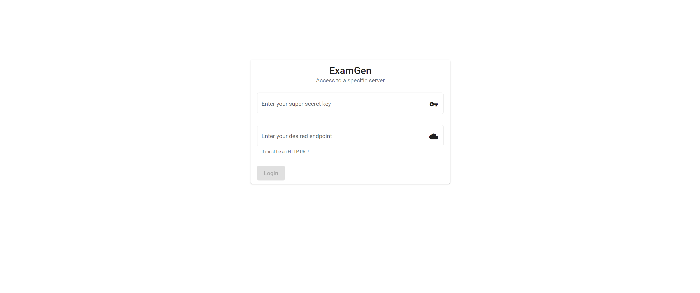
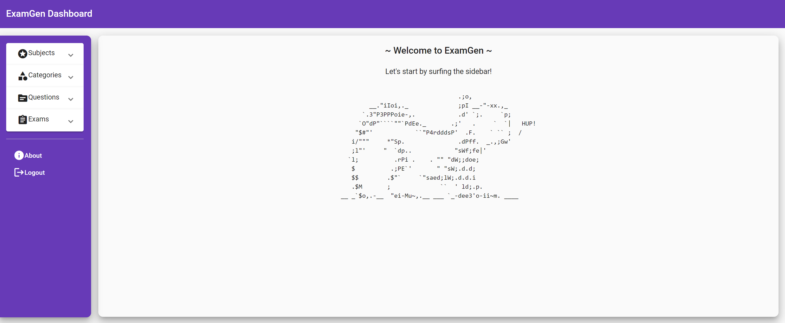
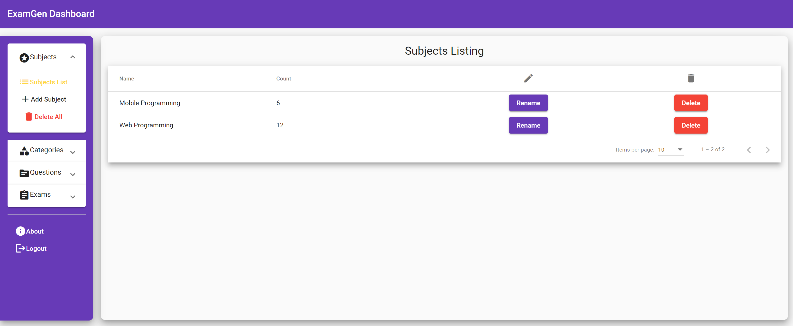
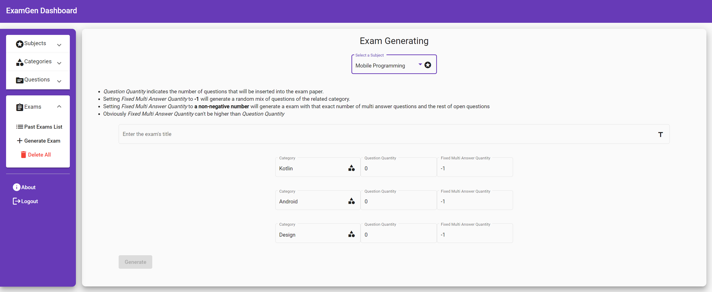

# :cloud: Exam-Gen (front-end) 

This project is a Single Page Application for my ExamGen service.

## :heart: Powered By

The SPA is based on:

- **Angular 12**, it is an application design framework and development platform for creating efficient and sophisticated single-page apps;
- **Angular Material**, a set of UI component infrastructure and Material Design components for mobile and desktop Angular web applications;
- **Angular Flex Layout**, it provides a sophisticated layout API using Flexbox CSS + mediaQuery;

## :bulb: Development server

Run `ng serve` for a dev server. Navigate to `http://localhost:4200/`. The app will automatically reload if you change any of the source files.

## :wrench: Build

Run `ng build` to build the project. The build artifacts will be stored in the `dist/` directory.

## :gear: Setup

After the Build process you can use any web server you want to create a virtual host that points to the `dist/examgen-client/` directory

